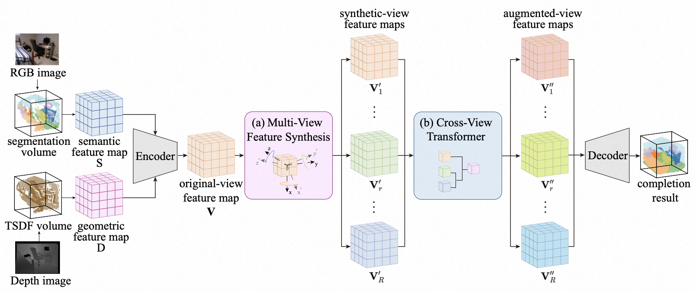
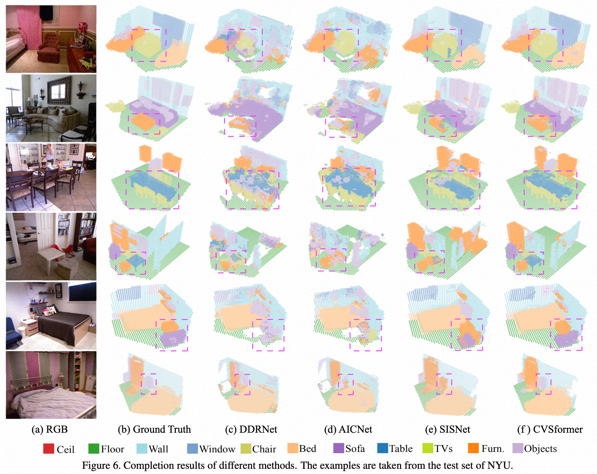

# CVSformer
[CVSformer: Cross-View Synthesis Transformer for Semantic Scene Completion](https://arxiv.org/abs/2307.07938)

# Instructions
## Environment
We use pytorch 1.9.0 with cuda 11.1. To build the environment, run:

    matplotlib
    opencv-python
    plyfile
    'trimesh>=2.35.39,<2.35.40'
    'networkx>=2.2,<2.3'
    tqdm
    ninja
    easydict
    argparse
    h5py
    scipy
## Dataset
For NYU, download from https://github.com/charlesCXK/TorchSSC.

For NYUCAD, download from https://github.com/UniLauX/PALNet.

You can train your segmentation to obtain the 2D input of CVSformer. We pre-train DeepLabv3 for 1,000 epochs to segment the RGB image.
## Training
    $ cd extensions 
    $ python setup.py install
    $ python -m torch.distributed.launch --nproc_per_node=$NGPUS train.py 
## Performance
You can obtain our SOTA model from https://pan.xunlei.com/s/VN_rkyLfy43RBn1BfXwrTJtGA1?pwd=qumh#.

NYU
<table>
  <tr>
    <th>Method</th>
    <th>SC IoU</th>
    <th>SSC mIoU</th>
  </tr>
  <tr>
    <td>Sketch</td>
    <td>71.3</td>
    <td>41.1</td>
  </tr>
  <tr>
    <td>SemanticFu</td>
    <td>73.1</td>
    <td>42.8</td>
  </tr>
  <tr>
    <td>FFNet</td>
    <td>71.8</td>
    <td>44.4</td>
  </tr>
  <tr>
    <td>SISNet(voxel)</td>
    <td>70.8</td>
    <td>45.6</td>
  </tr>
  <tr>
    <td>PCANet</td>
    <td>78.9</td>
    <td>48.9</td>
  </tr>
  <tr>
    <td>SISNet(voxel)</td>
    <td>78.2</td>
    <td>52.4</td>
  </tr>
  <tr>
    <td>CVSformer</td>
    <td>73.7</td>
    <td>52.6</td>
  </tr>
</table>
NYUCAD
<table>
  <tr>
    <th>Method</th>
    <th>SC IoU</th>
    <th>SSC mIoU</th>
  </tr>
  <tr>
    <td>Sketch</td>
    <td>84.2</td>
    <td>55.2</td>
  </tr>
  <tr>
    <td>SemanticFu</td>
    <td>84.8</td>
    <td>57.2</td>
  </tr>
  <tr>
    <td>FFNet</td>
    <td>85.5</td>
    <td>57.4</td>
  </tr>
  <tr>
    <td>SISNet(voxel)</td>
    <td>82.8</td>
    <td>57.4</td>
  </tr>
  <tr>
    <td>PCANet</td>
    <td>84.3</td>
    <td>59.6</td>
  </tr>
  <tr>
    <td>SISNet(voxel)</td>
    <td>86.3</td>
    <td>63.5</td>
  </tr>
  <tr>
    <td>CVSformer</td>
    <td>86.0</td>
    <td>63.9</td>
  </tr>
</table>

